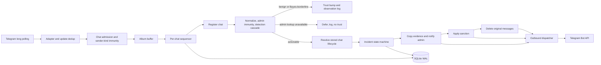

# Current architecture

This document describes the runtime that is wired today. Code and tests remain
the source of truth; the milestone documents under `docs/superpowers` preserve
design history and may describe intermediate states.

## Runtime path

The process starts in `cmd/tg-antispam/main.go`: it loads and validates YAML,
opens and migrates SQLite, starts the config watcher, metrics server, outbound
dispatcher, optional blocklist/LLM services, and finally long polling. The bot
uses inline handlers with one polling worker. Handler work that can block is
submitted to a per-chat sequencer, preserving order within a chat while
allowing different chats to progress concurrently.

Every outbound `telegram.Port` operation is implemented by
`internal/telegram.LivePort` and submitted to `internal/queue.Dispatcher` (the
client library owns the long-polling transport itself). This includes the
initial `GetMe`, which doubles as the startup token probe and is reused by
rights checks. The dispatcher applies global and
per-chat limits, prioritizes destructive moderation calls, and requeues a
request after Telegram returns HTTP 429. Caller cancellation is combined with
the dispatcher lifecycle context for the actual HTTP attempt.

## Message and incident flow

For a new or edited message, `internal/telegram.Handler`:

1. Persists the Telegram `update_id` dedup marker.
2. Checks the configured chat admission policy and sender-kind immunity.
3. Buffers media groups for 700 ms or immediately submits a standalone message
   to the chat sequencer.
4. Registers a previously unseen chat without overwriting stored lifecycle
   state.
5. Runs the detection hook against the first album part.
6. Bumps durable trust only for meaningful, non-actionable user messages.
7. For an actionable verdict, resolves the stored enabled/dry-run state and
   sends one incident with sorted message IDs to the state machine.

Incident dedup is durable on `(chat_id, first_message_id)`. The state machine
orders side effects as:

1. atomically insert `pending` and the verdict's audit row;
2. copy evidence messages to the admin chat;
3. send the admin summary and inline buttons;
4. save the copied message IDs and mark the incident `evidenced`;
5. in live mode, apply the configured sanction;
6. delete the original message or album;
7. optionally send a best-effort ephemeral notice;
8. mark the incident `done`.

Dry-run stops after evidence and admin notification. If evidence copying fails,
a verdict below confidence `0.9` stops without acting; a hard-confidence
verdict may continue after sending an admin warning. The currently wired
detectors emit confidence `1.0` for actionable hits.

## Detection order

`internal/detect.Cascade` normalizes all message text surfaces once, then uses
first-hit-wins ordering:

1. current-admin immunity;
2. global CAS/LOLS blocklist;
3. hard rules (stopwords, links for untrusted users, banned domains);
4. fake-admin detection for untrusted users;
5. duplicate, short-flood, and edit behavior;
6. naive Bayes for untrusted users;
7. optional LLM adjudication in the wiring layer for a Bayes-borderline result.

Admin identities use a TTL cache, invalidated on `my_chat_member` updates and
on the `chat_member` updates that actually touch the administrator roster
(ordinary joins and leaves do not drop it). An invalidation issued while a
fetch is in flight wins: that fetch's result is neither cached nor returned,
since it predates a roster change already known to be real. A failed refetch
returns the last good list *and* the error, for a bounded grace window of twice
the TTL. Both halves matter: a stale list is asymmetric evidence. A match on it
proves the sender was an administrator as of the last good lookup — a demotion
would have invalidated the entry — so immunity is granted. Absence proves
nothing, because an administrator promoted during the outage would be missing,
so every other sender is deferred rather than exposed to a punitive detector on
unverified data. A lookup outage therefore suppresses moderation for the chat,
which is the §4 fail-safe working as intended rather than a gap. Concurrent
misses for one chat share a single in-flight request, and a failing refetch
backs off to at most one retry per TTL. Once the list ages past the grace window — or when
there is no cached list at all — the cascade emits a non-actionable
`admin_lookup_unavailable` result, skips every punitive detector, and does not
increment trust. A deferred message is still recorded in every behavioral window, since the
update is already marked seen and will never be reprocessed.

The blocklist is an atomic in-memory snapshot refreshed from external sources.
LOLS full, LOLS delta, and CAS full data are retained separately: a failed or
empty source refresh keeps that source's last-good contribution while a
successful source can advance independently. The LLM stage is disabled by
default, bounded by a timeout, and errors toward not-spam. No message text is
sent to an LLM unless the stage is explicitly enabled.

The audit row records a verdict, not an outcome: it is written at the pending
stage, before the dry-run gate and before anything is applied. The daily
digest therefore joins each audit row to its incident's `dry_run` (immutable
after insert) and `state`, and reports applied, dry-run, and incomplete
actions as three separate groups rather than one total.

## State and ownership

SQLite runs in WAL mode with foreign keys, a busy timeout, and one serialized
writer goroutine. Concurrent reads use the underlying `sql.DB`. The schema
stores update IDs, chat lifecycle, incident/audit/evidence metadata, trust and
identity state, sample hashes, and Bayes counts. It intentionally does not
persist raw offending message text.

Behavioral windows, the blocklist snapshot, admin-list cache, rate limiters,
and metrics are in memory and are rebuilt on restart. SQLite-backed chat,
incident, trust, identity, and Bayes state survives restart.

Config reload parses and validates a complete candidate before atomically
swapping it; invalid edits leave the previous config active. The handler reads
chat mode, allowlist, and the default for newly registered chats from the live
store. Most constructed components retain the startup snapshot: changes to
detection, action, blocklist, LLM, ops, admin chat, and credentials require a
process restart to take effect.

## Error and shutdown policy

- An admin-list lookup outage defers all message moderation and grants no trust.
- LLM failures return not-spam; blocklist refresh failures retain per-source
  last-good data rather than clearing protection or inventing new IDs.
- Failure to read a stored chat lifecycle gate fails safe by suppressing live
  moderation.
- Unauthorized admin callbacks are answered but produce no action or learning
  side effect.
- A saturated per-chat sequencer queue drops new work and counts the drop
  rather than blocking the single polling consumer.
- On shutdown, polling and background producers stop first, bounded by their
  own 10s budget. A separate work context keeps the dispatcher alive while
  albums flush and accepted sequencer work drains, under its own 30s deadline
  armed only once the producers are done. After the drain completes—or after
  that deadline cancels remaining work—the dispatcher exits and the database
  closes last.

## Current implementation boundaries

These are useful distinctions between available interfaces/design intent and
what `main` wires today:

- `chats.mode: owners_only` is validated but currently follows the same
  admission path as `auto`; no owner-registration gate is wired.
- Admin buttons are RBAC-gated. `Confirm spam` and `False positive` record
  idempotent incident labels, but production callbacks do not currently carry
  evidence text, so online Bayes training is skipped. `Lift (no learn)` and
  `Delete evidence` currently acknowledge the callback without unmuting,
  unbanning, or deleting copied evidence.
- The store exposes chat disable and dry-run lifecycle primitives, but there is
  no operator command or HTTP admin surface wired to change them.
- `quarantine`, sender-chat bans, and admin-markup editing exist in domain/port
  surfaces but are not selectable actions in the current configuration path.

Treat these boundaries as explicit work items when changing adjacent behavior;
do not infer that an existing enum or port method is already reachable in
production.
