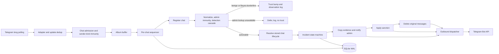

# Current architecture

This document describes the runtime that is wired today. Code and tests remain
the source of truth; the milestone documents under `docs/superpowers` preserve
design history and may describe intermediate states.

## Runtime path

The process starts in `cmd/tg-antispam/main.go`: it loads and validates YAML,
opens and migrates SQLite, starts the config watcher, metrics server, outbound
dispatcher, optional blocklist/LLM services, and finally long polling. The bot
uses inline handlers with one polling worker. Handler work that can block is
submitted to a per-chat sequencer, preserving order within a chat while
allowing different chats to progress concurrently.

Every outbound `telegram.Port` operation is implemented by
`internal/telegram.LivePort` and submitted to `internal/queue.Dispatcher` (the
client library owns the long-polling transport itself). This includes the
initial `GetMe`, which doubles as the startup token probe and is reused by
rights checks. The dispatcher applies global and
per-chat limits, prioritizes destructive moderation calls, and requeues a
request after Telegram returns HTTP 429. Caller cancellation is combined with
the dispatcher lifecycle context for the actual HTTP attempt.

## Message and incident flow

For a new or edited message, `internal/telegram.Handler`:

1. Persists the Telegram `update_id` dedup marker.
2. Checks the configured chat admission policy and sender-kind immunity.
3. Buffers media groups for 700 ms or immediately submits a standalone message
   to the chat sequencer.
4. Registers a previously unseen chat without overwriting stored lifecycle
   state.
5. Runs the detection hook against the album part that carries text (the
   first one whose text is non-empty, else the first part). Telegram allows an
   album's caption on any of its items and delivers the parts unordered, so
   judging `parts[0]` scored a captionless photo. Exactly one part is judged:
   `Decide` feeds the duplicate/short-message windows as a side effect.
6. Bumps durable trust only for meaningful, non-actionable user messages, and
   never for an edit — otherwise re-editing one message earns trust.
7. For an actionable verdict, resolves the stored enabled/dry-run state and
   sends one incident with sorted message IDs to the state machine.

Incident dedup is durable on `(chat_id, first_message_id)`. The state machine
orders side effects as:

1. atomically insert `pending` and the verdict's audit row;
2. copy evidence messages to the admin chat;
3. send the admin summary and inline buttons, as a reply to the first copied
   message — chats are moderated concurrently, so admin-chat order alone does
   not say which evidence a card belongs to;
4. save the copied message IDs and mark the incident `evidenced`;
5. in live mode, apply the configured sanction (a channel sender is banned
   with `banChatSenderChat`, which has no member to restrict);
6. delete the original message or album — also when the sanction failed, so a
   failed ban does not leave the spam standing;
7. optionally send a best-effort ephemeral notice;
8. mark the incident `done`.

Dry-run stops after evidence and admin notification. If evidence copying
fails, only a verdict that does not rest on the bot's own judgement may still
be enforced: an externally verifiable one — a CAS/LOLS blocklist hit — or a
moderator's explicit `/spam` or `/ban`, which reach the machine as the
`manual_spam` / `manual_ban` signals. Everything probabilistic (rules,
behavior, Bayes, LLM) stops without acting. Either way the admin chat is told
what happened, because "detected but not acted on" must not be silent, and the
card names an action only when one actually follows. The gate is the signal,
not `Confidence`: every wired detector emits `1.0`, so a confidence threshold
would let everything through.

The manual exception exists because the evidence copy is what lets a HUMAN
check a machine verdict, so requiring it before obeying that same human is
circular. It is not a small gap either: a quiz poll is uncopyable, so `/spam`
on one used to do nothing at all — and nothing could be done afterwards, since
a repeated `/spam` is rejected as already handled and the evidence-failure card
deliberately carries no enforce button.

The same order must also survive arriving SECOND. When the detector recorded
the message first and did not sanction it — its evidence copy failed on a
probabilistic verdict, or the chat was observing, or the verdict was
review-only — the moderator's `/spam` / `/ban` finds the row through the
`(chat_id, message_id)` dedup. Instead of stopping there, the machine claims the
row with one conditional UPDATE that is also the eligibility check
(`store.ClaimManualOverride`), applies the sanction to every recorded part,
rewrites the audit verdict to the moderator's and flips `dry_run` off
(`FinishManualOverride`), and posts a new card. A row that did sanction, or one
whose decision is claimed by the enforce button, is refused as already handled.

Copying can also fail without failing. `copyMessages` skips messages it cannot
copy — a quiz poll, for instance, whose option texts the detectors do judge —
and returns success regardless, so the id list can come back short or empty. An
empty one is treated exactly like a failed copy (step 2 above never produced
evidence, so the incident does not become `evidenced` and the rules of the
previous paragraph apply). A short one still sanctions — dropping the action
would let one uncopyable part shield the whole album — but the card carries
`evidence INCOMPLETE: copied N of M messages — the part that triggered the
verdict may be missing`. The wording is deliberate: an album is judged on the
single part carrying its text, and the copy result is destination ids with no
mapping back to the sources, so the count is known and the identity of the
missing parts is not.

Both outcomes are logged, and symmetrically: `internal/telegram` writes
`observed` for a message that passed, `internal/incident` writes `enforced`
(with `outcome=succeeded|partial|failed`, since `action_ok` and `deleted`
fail independently and neither landing must not read as a sanction) or
`not enforced` (with `dry_run` / `review_only`, or a `stage=` for an
incident that ended before enforcement) for one that raised an incident. The acted-on line prints signal NAMES only — a detail can hold a
display name, a phrase equal to the whole message, or a newline that would
forge a second line — while the pass line keeps the details that answer "why
did this get through?". Neither prints message text.

The ops server exposes `/healthz` (process liveness, used for readiness),
`/livez` (time since the last successful Telegram round trip, used for
liveness) and `/metrics`. A periodic GetMe feeds `/livez`, because update
traffic cannot: a quiet night in every chat is normal.

## Detection order

`internal/detect.Cascade` normalizes all message text surfaces once, then uses
first-hit-wins ordering:

1. current-admin immunity;
2. global CAS/LOLS blocklist;
3. hard rules (stopwords, links for untrusted users, banned domains and file types);
4. fake-admin detection for untrusted users;
5. duplicate, short-flood, and edit behavior;
6. naive Bayes for untrusted users;
7. optional LLM adjudication in the wiring layer for a Bayes-borderline result.

The file-type facts those rules read (and the LLM line below) are collected by
the adapter from every attachment field that carries them — `document`,
`video`, `animation`, `audio`, `voice`, `live_photo`, and the videos nested
inside `paid_media` — plus the same set on `external_reply`. Which one a file
arrives in is the sender's choice, not a property of the file, so a rule
reading only `document` was bypassed by uploading the same `.apk` as a video;
and `paid_media` needs a walk rather than a nil check, because it is a list
whose video items hold the `file_name` and `mime_type` one level down.

The filename is never kept, and that promise is enforced rather than assumed.
`path.Ext` returns everything after the last dot, so an extension is kept only
when it matches what an extension can look like — and shape alone is not
enough, since the sender picks the shape too: a trailing run of digits passes
any pattern and may be a phone number, so at least one ASCII letter is
required. A MIME type must parse as `type/subtype` once its parameters are cut,
AND its top-level half must be one of the ten in IANA's closed registry;
without that, `t.me/joinchat` is a perfectly well-formed "MIME type". Anything
else is dropped silently. The checks live in the adapter so they cover the
persisted audit row as well as the LLM payload, where an unchecked filename
would otherwise arrive as an authoritative-looking metadata fact — an injection
channel on top of the privacy leak.

Both patterns are narrower than the standards allow, deliberately: extensions
are ASCII-only and at most 12 characters, so `.sqlite-wal` and non-Latin
suffixes are dropped, and each MIME component is capped at 64 characters where
RFC 6838 permits 127. The values lost are type names no rule moderates on and
`MediaKinds` still names the attachment, so the cost is nil and the gain is
that no extra room exists for sender text to travel out labelled as a type. The
subtype is not constrained the same way — that registry is open — so
`text/answer_ham` still passes the boundary; metadata is reported, never
established.

Admin identities use a TTL cache, invalidated on `my_chat_member` updates and
on the `chat_member` updates that actually touch the administrator roster
(ordinary joins and leaves do not drop it). An invalidation issued while a
fetch is in flight wins: that fetch's result is neither cached nor returned,
since it predates a roster change already known to be real. A failed refetch
returns the last good list *and* the error, for a bounded grace window of twice
the TTL. Both halves matter: a stale list is asymmetric evidence. A match on it
proves the sender was an administrator as of the last good lookup — a demotion
would have invalidated the entry — so immunity is granted. Absence proves
nothing, because an administrator promoted during the outage would be missing,
so every other sender is deferred rather than exposed to a punitive detector on
unverified data. A lookup outage therefore suppresses moderation for the chat,
which is the §4 fail-safe working as intended rather than a gap. Concurrent
misses for one chat share a single in-flight request, and a failing refetch
backs off to at most one retry per TTL. Once the list ages past the grace window — or when
there is no cached list at all — the cascade emits a non-actionable
`admin_lookup_unavailable` result, skips every punitive detector, and does not
increment trust. A deferred message is still recorded in every behavioral window, since the
update is already marked seen and will never be reprocessed.

A `chat_member` update then runs a second step in the same per-chat sequencer
job, strictly after the identity watcher records the name. `JoinFromChatMemberUpdated`
treats a non-bot move from left, kicked, or restricted-but-not-a-member into
member (or restricted with `is_member`) as a join, and `watch.Welcomer` may
send an ephemeral greeting. The option is off unless `welcome` is enabled and
has text. It ignores the chat's dry-run flag: the message is a notice, not a
sanction, Telegram shows it only to the joining user, and delivery is not
guaranteed, so nothing else waits on it. Each (chat, user) is greeted once;
someone who already spoke, or who is blocklisted, is skipped; `welcome.max_per_minute`
caps a rolling minute so a join raid cannot fill the outbound queue. The send
is low priority. If Telegram answers with a `message_id` and no
`ephemeral_message_id`, that public copy is deleted and the call returns an
error, so an unhonored ephemeral parameter cannot leave the text in the chat.

The sequencer job only decides the greeting and reserves a rate-limit slot.
The send runs on its own goroutine, so a slow welcome cannot block moderation
for that chat. The reservation stays until the greeting is marked, so a second
join in that gap is not sent. The stamp on the rolling window is still the
moment the send finished.

A join can also be challenged (`captcha`, off unless enabled). This is not an
incident. The bot mutes the joiner (`new`), marks the row `challenged` and
sends an ephemeral button, or a chat message if that fails. The deadline is
rewritten when that prompt is stored, counted from that moment; the deadline
written at insert remains if the prompt never arrives. A press moves the row
to `passing` and then lifts the mute. Only `passed` means the person is known.
If the lift fails, the row stays `passing` and the sweep retries it. Deadlines
live in SQLite. A sweep at startup and every 5s finishes due rows: `kick` bans
then unbans, `keep_muted` leaves the mute, an orphan `new` is released, and
`passing` is lifted. `failing` and `passing` retry on the next sweep. The bot
does not lift a captcha mute when an incident since the challenge started has
an audit action of `delete_mute`, `mute`, or `ban`. `cap:` callbacks skip the
admin sequencer. Dry-run, a restricted joiner, a blocklisted id, a chat turned
off mid-challenge, and a prompt that cannot be stored fail open — unless that
mute must stay because of such a sanction. An admin change cancels the
challenge and the bot leaves that mute alone. A mute that lands after the
cancel is counted (`restrict_after_cancel`) and left in place. An explicit
`timeout: 0s` or an empty captcha text or button label is rejected; omitting
those keys uses the default.

The blocklist is an atomic in-memory snapshot refreshed from external sources.
LOLS full, LOLS delta, and CAS full data are retained separately: a failed or
empty source refresh keeps that source's last-good contribution while a
successful source can advance independently. The LLM stage is disabled by
default, bounded by a timeout, and errors toward not-spam. No message text is
sent to an LLM unless the stage is explicitly enabled.

What that stage is shown is assembled by `llmMessageText` in the wiring layer,
not by the cascade: the message text, one line of the message's own structural
facts (attachment kinds, document extension/MIME, forwarded, inline keyboard),
and — when the message is a reply whose parent carries an attachment — a
second, separately labelled line with that parent's attachment types. The
parent's TEXT is not sent: it is another person's message, and the signal a
carrier/comment pair produces lives in the type of the file, not in its
caption.

Telegram delivers that parent in one of two ways, and `llmMessageText` reads
both. A reply within the chat arrives as `reply_to_message` and reaches the
domain envelope as `domain.Message.ReplyTo`. A reply **across chats** — the
parent lives in a channel or a group the bot is not in — arrives with
`reply_to_message` EMPTY and the parent described in `external_reply`; the
adapter reads its attachment types into the separate
`ExternalReplyMediaKinds` / `ExternalReplyDocumentExtensions` /
`ExternalReplyDocumentMIMETypes` fields. `replyParentFacts` picks whichever of
the two is present (in-chat first, as the richer record) and renders it through
the same `attachmentFacts` helper as the judged message itself, so exactly one
parent line is emitted and the same `.apk` cannot be described in two wordings.

The external parent stays out of `ReplyTo` on purpose. `ReplyTo` is what
`internal/admin` resolves as the TARGET of a moderator's `/spam` and `/ham` —
the message to delete, the author to ban — and an external reply names a
message id in a chat this bot does not moderate; a synthetic parent there would
silently re-aim an admin command outside the chat.

The reply parent's ATTACHMENTS stop at the LLM stage. Neither form of them is
threaded into `detect.Normalize` or `NormalizedMessage`, so no hard rule,
behavioral window or Bayes score can fire on a file the sender did not post —
replying to a malicious file is what a warning looks like, and only the
fail-open, advisory LLM stage is allowed to weigh that context.

Text is the older and narrower exception, and predates the attachment work:
`Normalize` does concatenate `ExternalReplyText` into the blob it judges. That
field is not the parent's message. The adapter fills it only when the parent is
external AND the sender attached a quote (`m.Quote`), i.e. from the excerpt the
REPLIER chose and shipped inside their own message — which is why it is judged
like the rest of their text rather than as someone else's. The parent's own
unquoted text is never read, in either reply form, and neither is an in-chat
parent's text.

The audit row records a verdict, not an outcome: it is written at the pending
stage, before the dry-run gate and before anything is applied. The daily
digest therefore joins each audit row to its incident's `dry_run` (immutable
after insert) and `state`, and reports applied, dry-run, and incomplete
actions as three separate groups rather than one total.

## State and ownership

SQLite runs in WAL mode with foreign keys, a busy timeout, and one serialized
writer goroutine. Concurrent reads use the underlying `sql.DB`. The schema
stores update IDs, chat lifecycle, incident/audit/evidence metadata, trust and
identity state, sample hashes, and Bayes counts. It intentionally does not
persist raw offending message text.

Behavioral windows, the blocklist snapshot, admin-list cache, rate limiters,
and metrics are in memory and are rebuilt on restart. SQLite-backed chat,
incident, trust, identity, and Bayes state survives restart.

Config reload parses and validates a complete candidate before atomically
swapping it; invalid edits leave the previous config active. The handler reads
chat mode, allowlist, and the default for newly registered chats from the live
store. Most constructed components retain the startup snapshot: changes to
detection, action, blocklist, LLM, ops, admin chat, and credentials require a
process restart to take effect.

## Error and shutdown policy

- An admin-list lookup outage defers all message moderation and grants no trust.
- LLM failures return not-spam; blocklist refresh failures retain per-source
  last-good data rather than clearing protection or inventing new IDs.
- Failure to read a stored chat lifecycle gate fails safe by suppressing live
  moderation.
- Unauthorized admin callbacks are answered but produce no action or learning
  side effect.
- A saturated per-chat sequencer queue drops new work and counts the drop
  rather than blocking the single polling consumer.
- On shutdown, polling and background producers stop first, bounded by their
  own 10s budget. A separate work context keeps the dispatcher alive while
  albums flush and accepted sequencer work drains, under its own 30s deadline
  armed only once the producers are done. After the drain completes—or after
  that deadline cancels remaining work—the dispatcher exits and the database
  closes last.

## Current implementation boundaries

These are useful distinctions between available interfaces/design intent and
what `main` wires today:

- `chats.mode: owners_only` is validated but currently follows the same
  admission path as `auto`; no owner-registration gate is wired.
- Admin buttons are RBAC-gated and are real moderation, not bookkeeping:
  `False positive` and `Lift (no learn)` call Telegram to unban or fully unmute
  (`UnrestrictMember`, not a permissive `RestrictMember`), `Delete evidence`
  deletes the copied messages, and `Confirm spam` / `False positive` /
  `Enforce` train Bayes. Training reads the tokens captured at detection time
  and stored with the incident, so the callback payload carries no evidence
  text and does not need to; `Lift (no learn)` drops those tokens instead of
  feeding them. Each incident admits one decision, so a press on an old card
  answers "already decided" rather than issuing a fresh unban that might lift a
  later, unrelated sanction. The one thing no button can do is restore deleted
  messages — Telegram offers no such call — and the toast says so.
- The store exposes chat disable and dry-run lifecycle primitives, but there is
  no operator command or HTTP admin surface wired to change them.
- `quarantine`, sender-chat bans, and admin-markup editing exist in domain/port
  surfaces but are not selectable actions in the current configuration path.

Treat these boundaries as explicit work items when changing adjacent behavior;
do not infer that an existing enum or port method is already reachable in
production.
